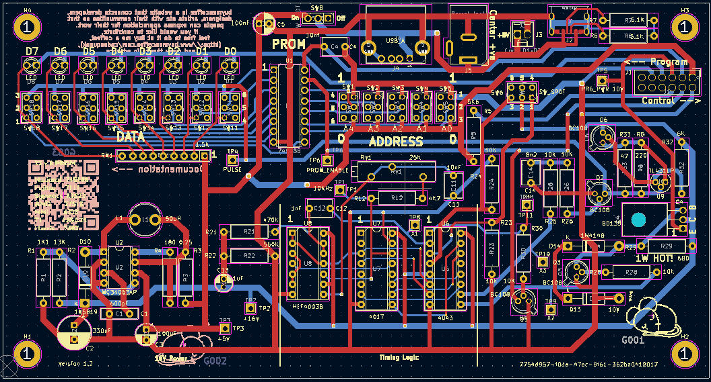
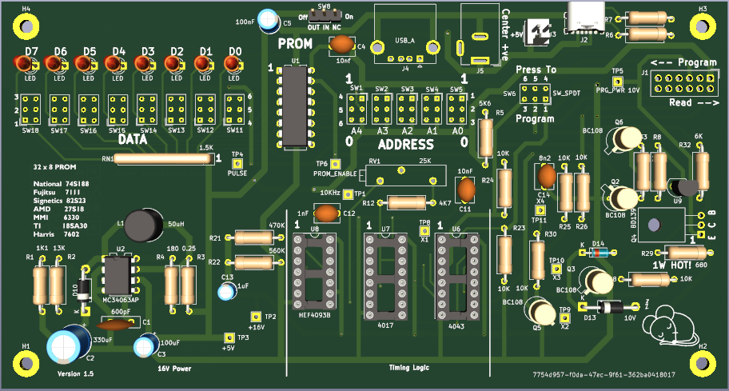

# PROM Programmer and Editor 1.0

PROM programmere for the following 32 x 8 PROM's

National  74S188
Fujitsu   7111
Signetics 82S23
AMD       27S18
MMI       6330
TI        18SA30
Harris    7602

## Introduction

This board has been designed to allow the programming and editing of the above PROM's

* Programming timings as per the manufacturers recommendations
* All components are readily available from commercial component suppliers (..and eBay!)
*	Copious test points
* Full documentation

For full documentation, see the [pdf here](FDC.pdf).  

 

 
