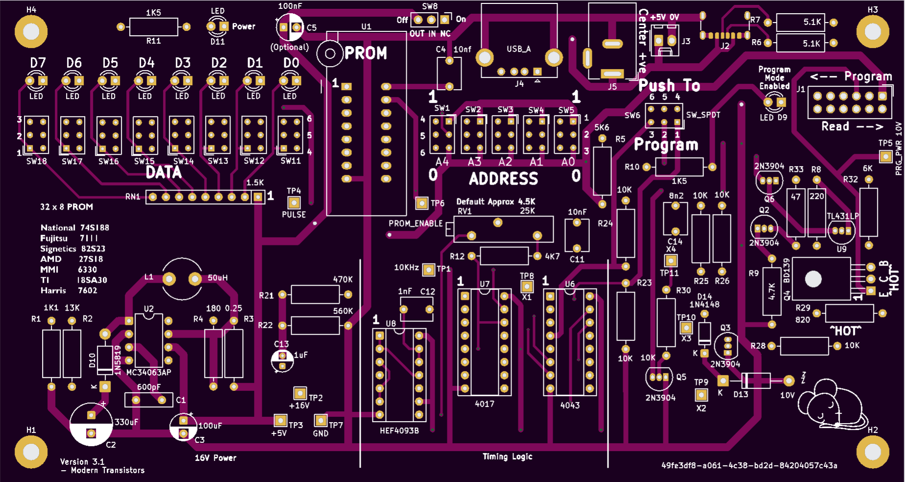
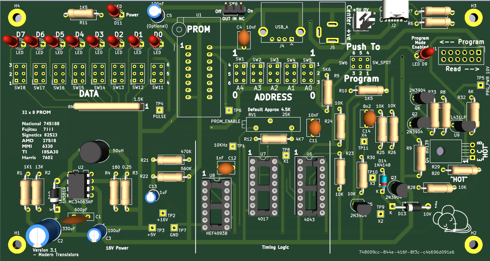

# PROM Programmer and Editor

PROM programmere for the following 32 x 8 PROM's

* National  74S188
* Fujitsu   7111
* Signetics 82S23
* AMD       27S18
* MMI       6330
* TI        18SA30
* Harris    7602

## Introduction

This board has been designed to allow the programming and editing of the above PROM's

* Programming timings as per the manufacturers recommendations
* All components are readily available from commercial component suppliers (..and eBay!)
*	Copious test points
* Full documentation

For full documentation, see the [pdf here](PROM_Programmer.pdf)

 

* Yellow = Program Power (Vcc) (10v)
* Pink = Program Pulse (16v)
* Cyan = Chip Enable (CE) (5v)

Supply power is first applied (10v), then the programming voltage applied (16v), followed by the CE low to perform the programming step.

Note that the traces have been offset by -1.0v and -2.0v so they do not overlap on the image

 

 
